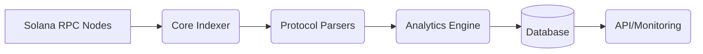
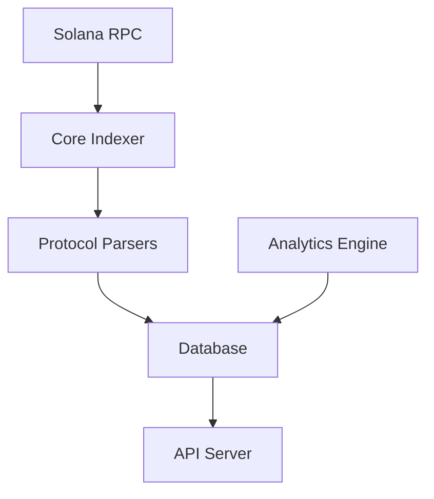
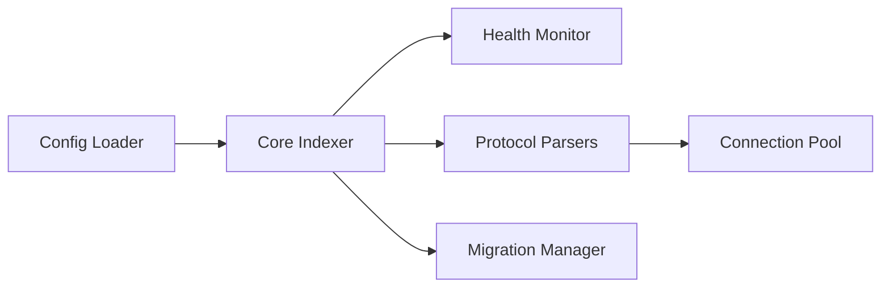
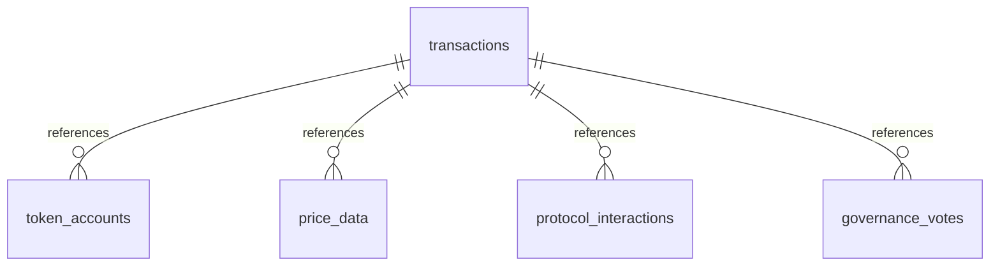

# Solana Analytics Backend

A robust Solana analytics backend with PostgreSQL integration, built in Rust.

## Architecture Overview

### High-Level System Architecture

*Data flows from Solana RPC nodes through the indexer and protocol parsers, into the analytics engine and database, and is served via API and monitoring endpoints.*

### Data Flow Diagram

*Shows the step-by-step flow from RPC ingestion to analytics and API serving.*

### Module/Component Diagram

*Illustrates the main modules and their interactions within the system.*

### Database Schema Overview

*Overview of the main database tables and their relationships.*

## Features

- **Database Layer**
  - PostgreSQL integration with connection pooling
  - Automatic schema migrations
  - Robust error handling
  - Connection retry logic
  - Health checks

- **Data Models**
  - Transaction tracking
  - Token account monitoring
  - Price history
  - Protocol interactions
  - Governance votes

- **RPC Client**
  - Multiple endpoint support with failover
  - Connection pooling
  - Retry logic with exponential backoff
  - Rate limiting
  - Health monitoring
  - Request/response caching

## Installation

Add to your `Cargo.toml`:

```toml
[dependencies]
solana-rpc-client = { git = "https://github.com/yourusername/solana-rpc-client" }
```

## Usage

```rust
use solana_rpc_client::{Database, DatabaseConfig, Result};

#[tokio::main]
async fn main() -> Result<()> {
    // Configure database
    let config = DatabaseConfig::default();
    
    // Initialize database
    let db = Database::new(config).await?;
    
    // Run migrations
    db.run_migrations().await?;
    
    Ok(())
}
```

## Database Schema

The system includes the following tables:

- `transactions`: Tracks Solana transactions
- `token_accounts`: Monitors token account balances
- `price_history`: Records token price history
- `protocol_interactions`: Tracks protocol interactions
- `governance_votes`: Records governance voting activity

## Configuration

Database configuration can be set via environment variables or configuration file:

```toml
[database]
host = "localhost"
port = 5432
username = "postgres"
password = "postgres"
database = "solana_analytics"
max_connections = 10
connection_timeout = "30s"
```

## Error Handling

The system uses a custom error type `DatabaseError` that covers various failure scenarios:

```rust
pub enum DatabaseError {
    ConnectionError(deadpool_postgres::PoolError),
    BuildError(deadpool_postgres::BuildError),
    QueryError(tokio_postgres::Error),
    MigrationError(String),
}
```

## Testing

Run tests with:

```bash
cargo test
```

## License

MIT
